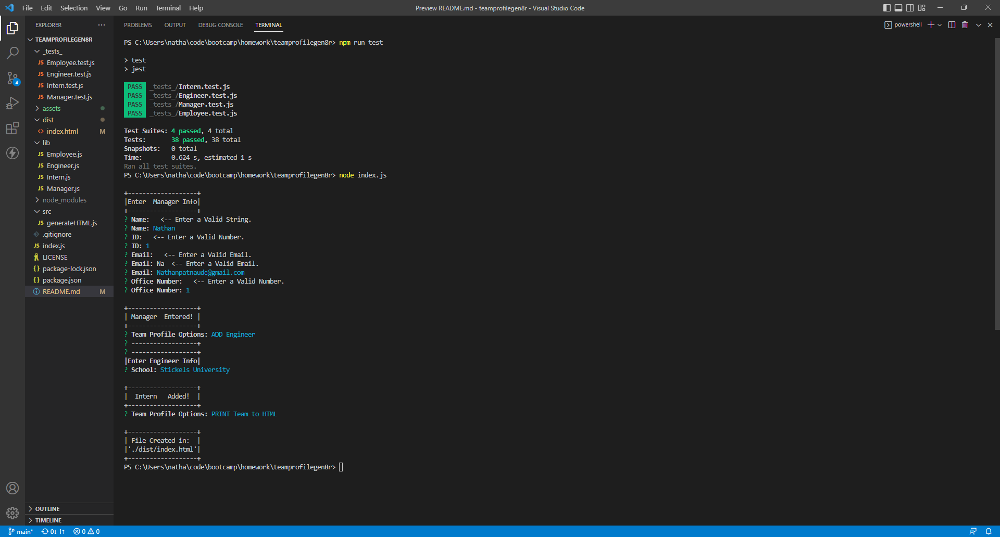
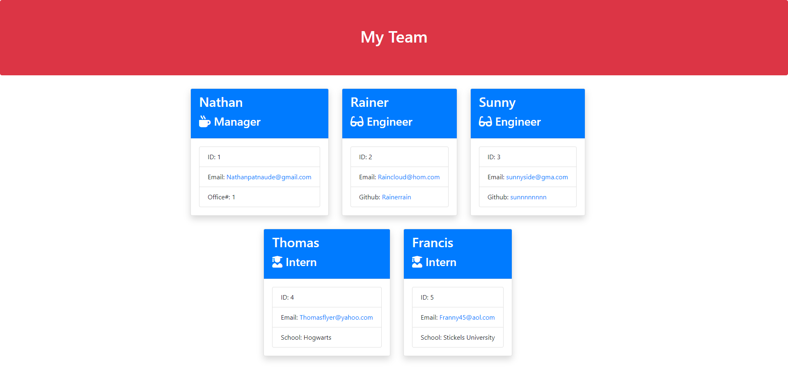

# Team Profile Gen8r

## Table of Contents
- [Description](#description)
- [User Story](#user-story)
- [Acceptance Criteria](#acceptance-criteria)
- [Table of Contents](#table-of-contents)
- [Installation](#installation)
- [Usage](#usage)
- [Tests](#tests)
- [Questions](#questions)


## Description
  
A node.js application that prompts used from inquirer to obtain a team profile containing a Manager and his team, composed of Engingeers and Interns.
This application returns a single webpage displaying the TeamProfile in a card HTML format.
The prompt also validates the user input for the appropriate information in each question.

It contains:
- employee name
- employee id
- employee email
- manager's officeNumber
- engineer's githubprofile link
- intern's school name

 The HTML file is generated with the user input and created into [./dist/index.html(./dist/index.html)</br></br></br></br></br>[CLICK HERE -- The file showing full functionality of the application](https://youtu.be/HX4kLhPJZ3o)  
  


## User Story
  
```
AS A manager
I WANT to generate a webpage that displays my team's basic info
SO THAT I have quick access to their emails and GitHub profiles
```
  

## Acceptance Criteria
  
``` 
GIVEN a command-line application that accepts user input
WHEN I am prompted for my team members and their information
THEN an HTML file is generated that displays a nicely formatted team roster based on user input
WHEN I click on an email address in the HTML
THEN my default email program opens and populates the TO field of the email with the address
WHEN I click on the GitHub username
THEN that GitHub profile opens in a new tab
WHEN I start the application
THEN I am prompted to enter the team manager’s name, employee ID, email address, and office number
WHEN I enter the team manager’s name, employee ID, email address, and office number
THEN I am presented with a menu with the option to add an engineer or an intern or to finish building my team
WHEN I select the engineer option
THEN I am prompted to enter the engineer’s 
name, ID,  email, and GitHub username, and I am taken back to the menu
WHEN I select the intern option
THEN I am prompted to enter the intern’s name, ID, email, and school, and I am taken back to the menu
WHEN I decide to finish building my team
THEN I exit the application, and the HTML is generated
```


## Installation 
Run the following commands at the project root directory.</br></br>- `npm init`</br>- `npm install inquirer`
  

## Usage 
Run the following commands at the project root directory</br></br>`node index.js`


## Tests
4 test Files included in './_tests_/'</br>
All 38 tests pass and can be seen passing the functionality video.</br>
Run using jest in npm:</br>
`npm run test`


## Questions
[Nathan Patnaude](mailto:Nathanpatnaude@gmail.com) , [GitHub Account](https://github.com/Nathanpatnaude)<br />
This Project is on [GitHub](https://github.com/Nathanpatnaude/teamprofilegen8r)